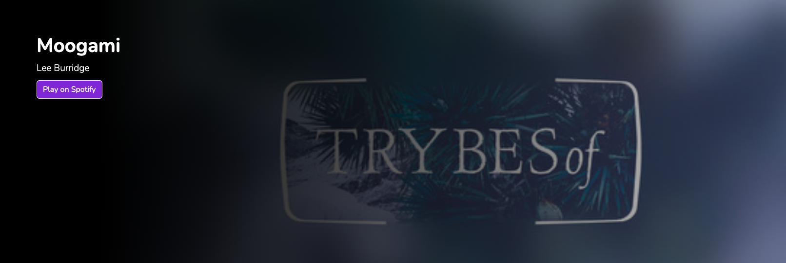
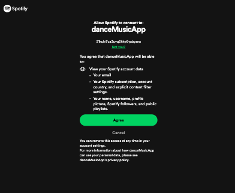
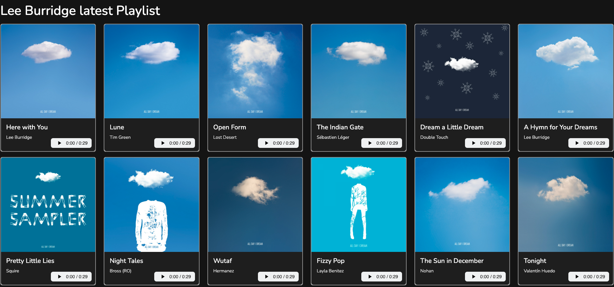
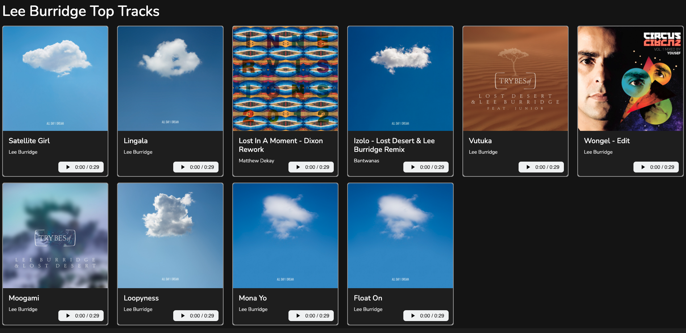
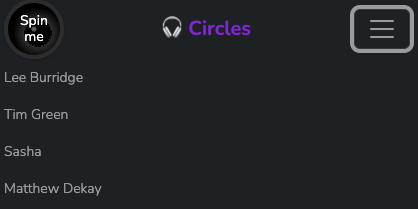

# DanceMusicApp

I’m so happy to finally finish the first version of the Angular project I have been working on for several months. As a Deep House music fan, I wanted to develop an app with Angular and the Spotify Api to view the latest tracks and playlists found on the platform of my favorite Djs. I wanted the user to beable to hear snippets of the tracks and then beable to click on a link to play the full version on Spotify.

## Table of contents

- [Overview](#overview)
  - [The challenge](#the-challenge)
  - [Screenshot](#screenshot)
  - [Links](#links)
- [My process](#my-process)
  - [Built with](#built-with)
  - [What I learned](#what-i-learned)
  - [Continued development](#continued-development)
  - [Useful resources](#useful-resources)
- [Author](#author)

## Overview

### The challenge

Users should be able to:

- View the optimal layout for the app depending on their device's screen size
- Authenticate with the Spotify api to get the relevant data to the front end.
- Navigate between Home and other dj pages
- Click on audio snippets of the tracks to get a feel for the record
- Click on the image of the track to navigate to the spotify app to hear the full record

### Screenshots

- Header with Spin me button to authenticate with the Spotify Api.
  

- Slider Component.
  

- Screen to auth app with spotify
  

- Artist playlist component
  

- Artist top track component
  

- Footer component
  

- small and medium screen nav bar
  

- small and medium screen nav bar
  

### Links

- Code URL: [Dance Music App Code on Git hub](https://github.com/J-R77-stack/dance-Music-App-Angular-App)
- Live Site URL: [ Dance Music App live site](https://dance-music-app-angular-app.vercel.app/)

## My process

### Built with

- Semantic HTML5 markup
- scss styles
- Bootstrap 5
- Mobile-first workflow
- [Spotify API](https://developer.spotify.com/)
- [Angular](https://angular.dev/)

### What I learned

This was a very difficult project and I spent countless hours trying different things and reading stuff online and also researching the spotify docs to find the information I needed, Somehow after much perseverance I managed to get the app working using various bits of information jumbled together.
which I will share at the botton of the page.

The Spotify API provides access to user related data, like playlists and music. The base address of Web API is https://api.spotify.com. The API provides a set of endpoints, each with its own unique path. All requests to Web API require authentication. This is achieved by sending a valid OAuth access token in the request header.

In order to centralize requests to Spotify, I have created a Service called spotify-auth.service.ts, in which I used the PKCE extension to keep my 'client secret' a secret. I created a spotify app in the api to obtain a 'client secret and client id'. This then allowed me to obtain a new access token whenever I made get requests to the api. I then set up the redirect URI to “http://localhost:4200/callback” for development and 'https://dance-music-app-angular-app.vercel.app/callback' for production.

I installed sha.js which will be used to hash with Sha256 which is needed for PKCE in the spotify-auth.service.ts. It allowed me to get a new access token everytime i authenticated with the spotify api instead of having to manually insert it every hour

### Continued development

- Imporve the app to include a search function and maybe add more artists. Also add artist pictures and tour dates and possibly videos of latests sets in interesting places.

- Continue my Angular journey

### Useful resources thant helpped me with the spotify API

- [Spotify Api Documentation](https://developer.spotify.com/documentation/web-api) - This helped me to understand the basics of working with the api
- [Angular Tutorial](https://danielmccannsayles.medium.com/angular-tutorial-spotify-oauth2-authorization-code-flow-with-pkce-bbe9ecc3680a) - This is an amazing article which helped me finally understand how to use the Spotify OAuth2 Authorization Code Flow with PKCE I'd recommend it to anyone still learning this concept.
- [ Connecting to the Spotify Api ](https://ritvikbiswas.medium.com/connecting-to-the-spotify-api-using-node-js-and-axios-client-credentials-flow-c769e2bee818) - This was also a great article which helped me to understand the basics of working with the api
- [w3schools](https://www.w3schools.com/) - A great webpage for someone beginning their journey with code.
- [stackoverflow](https://stackoverflow.com/) - Another very useful site.

## Author

- Website - [Johnny Ramsay](https://my-portfolio-nu-two-52.vercel.app/)
- Frontend Mentor - [@J-R77-stack](https://www.frontendmentor.io/profile/J-R77-stack)
- Linkedin - [@johnny-ramsay](https://www.linkedin.com/in/johnny-ramsay-developer/)
